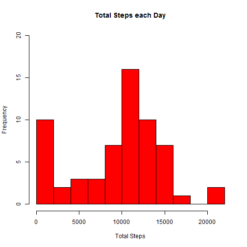
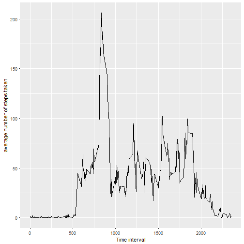
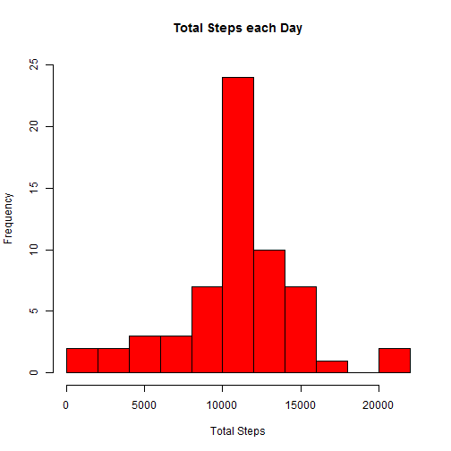
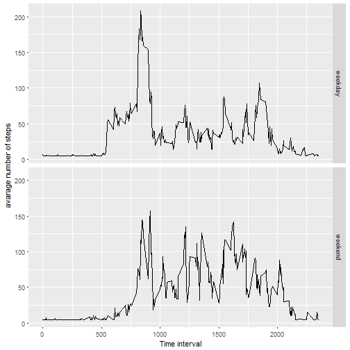

Reporducible Research : Project 1
===================================


1. Code for reading in the dataset and/or processing the data


```r
activityData <- read.csv("activity.csv")
```

2. Histogram of the total number of steps taken each day


```r
totalStepsEachDay <- tapply(activityData$steps, activityData$date, sum, na.rm=TRUE)
hist(totalStepsEachDay, main = "Total Steps each Day", xlab = "Total Steps", 
     ylab = "Frequency", xlim = c(0,22000), ylim = c(0,20), breaks = 11, 
     col = "red", border = "black")
```




3. Mean and median number of steps taken each day


```r
meanStepsEachDay <- mean(totalStepsEachDay)
medianStepsEachDay <- median(totalStepsEachDay)
```

* Mean for number of steps taken each day is **9354.2295082**
* Median for number of steps taken each day is **10395** 


4. Time series plot of the average number of steps taken


```r
library(ggplot2)
averageStepsPerTimeInterval <- aggregate(x=list(meanSteps=activityData$steps), 
                                         by=list(interval=activityData$interval),
                                         FUN=mean, na.rm=TRUE)
ggplot(data=averageStepsPerTimeInterval, aes(x=interval, y=meanSteps)) +
  geom_line() +
  xlab("Time interval") +
  ylab("average number of steps taken") 
```




5. The 5-minute interval that, on average, contains the maximum number of steps


```r
maxSteps <- which.max(averageStepsPerTimeInterval$meanSteps)
```

* The **104^th^** 5-minute interval contains the maximum number of steps.


6. Code to describe and show a strategy for imputing missing data

```r
library(Hmisc)
totalMissingValues <- length(which(is.na(activityData$steps)))
activityDataImputed <- activityData
activityDataImputed$steps <- impute(activityData$steps, fun=mean)
```

7. Histogram of the total number of steps taken each day after missing values are imputed


```r
totalStepsEachDayImputed <- tapply(activityDataImputed$steps, activityDataImputed$date, sum, na.rm=TRUE)
hist(totalStepsEachDayImputed, main = "Total Steps each Day", xlab = "Total Steps", 
     ylab = "Frequency", xlim = c(0,22000), ylim = c(0,25), breaks = 11, 
     col = "red", border = "black")
```



```r
meanStepsEachDayImputed <- mean(totalStepsEachDayImputed)
medianStepsEachDayImputed <- median(totalStepsEachDayImputed)
```

* Mean for number of steps taken each day after imputation is **1.0766189 &times; 10<sup>4</sup>**
* Median for number of steps taken each day after imputation is **1.0766189 &times; 10<sup>4</sup>** 


8. Panel plot comparing the average number of steps taken per 5-minute interval across weekdays and weekends


```r
activityDataImputed$dateType <-  ifelse(as.POSIXlt(activityDataImputed$date)$wday %in% c(0,6), 
                                        'weekend', 'weekday')
averagedActivityDataImputed <- aggregate(steps ~ interval + dateType, data=activityDataImputed, mean)
ggplot(averagedActivityDataImputed, aes(interval, steps)) + 
    geom_line() + 
    facet_grid(dateType ~ .) +
    xlab("Time interval") + 
    ylab("avarage number of steps")
```


